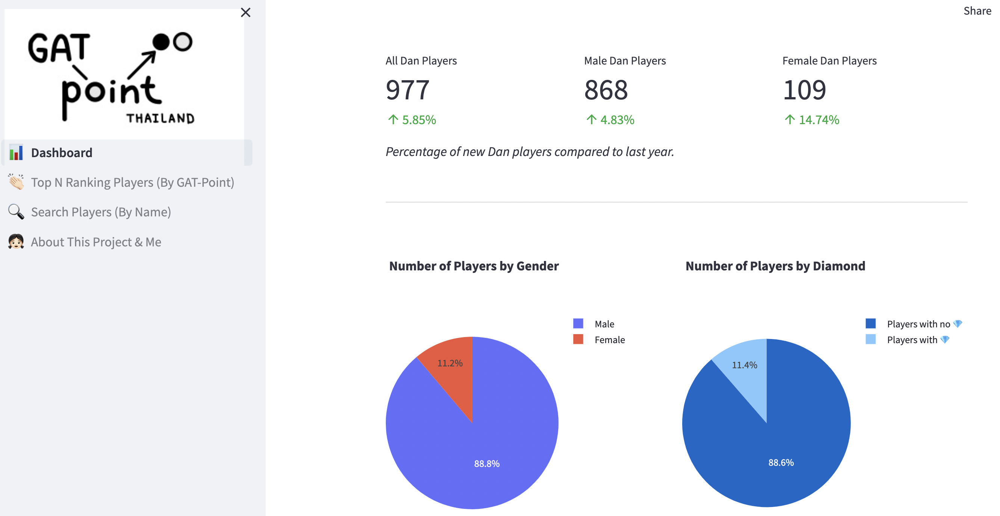
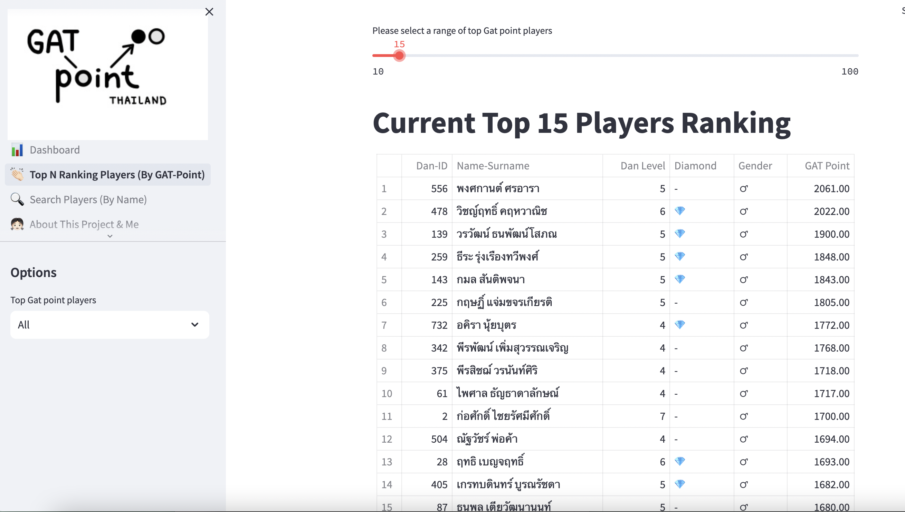
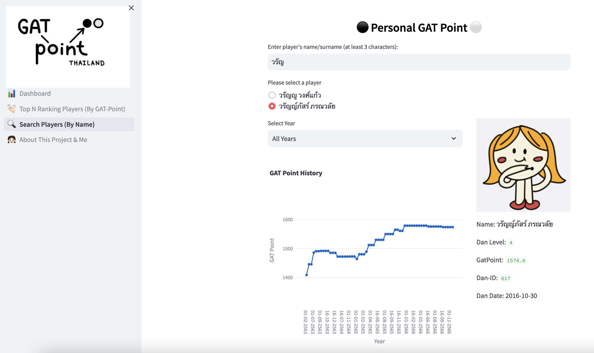

# Thailand Go GAT Point Data Analysis and Visualization Website

#### Video Demo:  <URL HERE>

#### Application Demo: https://gat-point.streamlit.app

#### Description:

This CS50 final project is a web application hosted on Streamlit to analyze and visualize the GAT Points data for all Go Dan-level players in Thailand. It is developed using Python programs with several libraries such as Pandas, Plotly, and Streamlit.

#### Background:

Go is a mind sport where two players aim to surround more territory than the opponent. The game was invented in China more than 4,500 years ago. As an amateur Go player in Thailand, I have developed a Web application that analyzes and visualizes **GAT-point** data of all Dan-level players in Thailand. GAT-point measures the players' Go strengths in Thailand, similar to the Elo rating. It is updated twice a month on Google Sheets by the Thailand Go Association. The data is about a four-year span of almost 1000 Dan-level players. It is not easy to view the insight of this data on Google Sheets. Therefore, this project performs GAT-point data analysis to display more meaningful information on the website, enabling all Dan players in Thailand to view their GAT-Point status and progress in charts easily. Lastly, I hope this project will promote the Go game to the Thai community.

#### User Interface
**Dashboard Page**

**Top N-Ranking Player Page**

**Search Players Page**

#### Development Process
There are two processes in this project. (1) Data Preparation process, and (2) Data Analysis and Visualization process.

#### Data Preparation
A Python program named "data_cleanning.py" is written to download the current GAT-point data for the year 2023 from [Google Sheets](https://drive.google.com/file/d/14SMzCtmljfmfT2OpVxmrN0XrBb1P4hCU/view) in a CSV format. Pandas library is used to clean the data to remove unnecessary data, correct wrong-spaced column names, handle missing/wrong data, and format data so that it is easy to analyze. The data in the year 2023 is merged with the CSV data files from previous years (2020-2022). The output of this process is a cleaned CSV data file named "thaigo-all.csv".

#### Data Analysis and Visualization
The data is analyzed and visualized on a Website using Python programs with Pandas, Plotly and Streamlit libraries. There are three main files in this Web application.
- **dashboard.py** - Display information on a dashboard page, such as the number of Dan players in Thailand, the percentage number of male/female Dan players, and the new Dan players each year.
- **1_👏🏻Top_N_Ranking_Players_(By_GAT-Point).py** - It will display Top N-ranking players (All, Male, Female players) based on their GAT-point. Users can choose the Top N-ranking players using a slider UI. This page will display a list of player's data in the table.
- **2_🔍Search_Players_(By_Name).py** - Users can search the player's data by entering their name or surname. Then, this web page will display a line chart of the Gat-Point history for the selected year.
